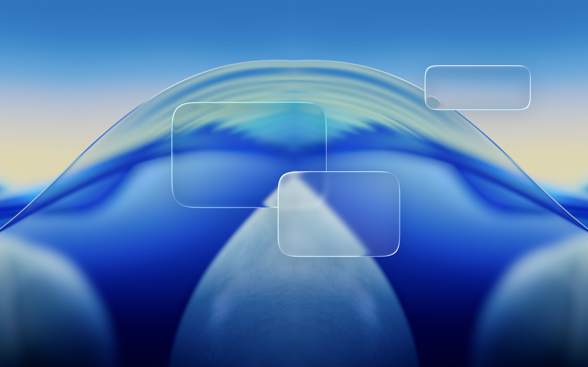
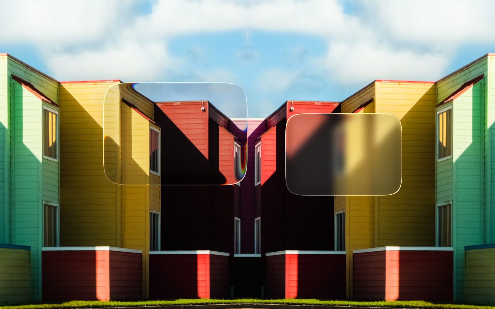

# liquid_glass_container

Liquid glass for Flutter. Each glass pane refracts the pixels behind it in one fragment-shader draw. The effect is a port of [liquid-glass-studio](https://github.com/iyinchao/liquid-glass-studio) (final STEP 9 composite). One implementation runs on iOS, Android, desktop, and web.



## Features

- Real refraction, chromatic dispersion, fresnel, glare, backdrop blur, tint, and drop shadow.
- Superellipse outlines: fixed or relative corner radius, capsule, circle, and rectangle.
- `Container` sizing with `padding`, `alignment`, and `clipBehavior`. Intrinsics, dry layout, and baselines work. The pane hit-tests its exact outline.
- Inherited settings. Set defaults once on the scope. Each pane can override single fields.
- Glass on glass: a pane refracts the panes below it, and also their children.
- Implicit animation of the size and of every setting with `AnimatedLiquidGlassContainer`.
- Fast: the scope makes a new capture only when the backdrop content changes. Glass that moves over a static backdrop causes zero rasterizations per frame.
- Web fallback: CanvasKit builds use a `BackdropFilter` pipeline with no GPU readbacks.



## Getting started

Wrap the app, or a subtree, in one `GlassBackdropScope`. Put `LiquidGlassContainer`s anywhere below it:

```dart
import 'package:liquid_glass_container/liquid_glass_container.dart';

GlassBackdropScope(
  settings: const LiquidGlassSettings(blurRadius: 10),   // optional, inherited by all panes
  child: Stack(children: [
    background,
    Center(
      child: LiquidGlassContainer(
        padding: const EdgeInsets.all(24),
        child: Text('Hello'),                            // pane wraps its child
      ),
    ),
  ]),
)
```

A pane gets its size like a `Container`: explicit `width`/`height` win. Without them, the pane wraps its child plus `padding`. A pane with no child expands. The child paints on top of the glass. Its own pane does not refract it, but a pane stacked on top does.

All visual settings live in `LiquidGlassSettings`. Each field is nullable, and a null field inherits its value: package defaults ← `GlassBackdropScope.settings` ← the pane's own `settings`. A pane that only wants more blur passes exactly that:

```dart
LiquidGlassContainer(
  settings: const LiquidGlassSettings(blurRadius: 40),  // everything else from the scope
)
```

| Field | Default | Meaning |
|---|---|---|
| `shape` | relative superellipse, factor 0.8, roundness 5 | Pane outline: `GlassShape.superellipse` (radius in logical px), `.relative` (fraction of half the short side), `.capsule()`, `.circle()`, `.rect()`; `roundness` is the corner exponent, 2 (round) .. 7 (squircle) |
| `thickness` | 20 | Refraction band depth, logical px |
| `indexOfRefraction` | 1.4 | 1 (none) .. ~2.5 |
| `dispersion` | 7 | Chromatic dispersion, 0 .. 50 |
| `fresnelRange` / `fresnelHardness` / `fresnelIntensity` | 30 / 0.2 / 0.2 | Fresnel rim light (hardness/intensity 0..1) |
| `glareRange` / `glareHardness` / `glareIntensity` / `glareConvergence` / `glareOppositeIntensity` / `glareAngle` | 30 / 0.2 / 0.9 / 0.5 / 0.8 / -π/4 | Specular glare band (angle in radians) |
| `blurRadius` | 1 | Backdrop blur radius, logical px |
| `blurEdge` | true | Blur reaches into the refraction band |
| `tint` | transparent | LCH-blended tint color |
| `shadowBlur` / `shadowIntensity` / `shadowOffset` | 25 / 0.15 / (0, 10) | Drop + interior shadow (offset y-down) |

All units follow Flutter conventions: logical px, 0..1 fractions, radians, y-down offsets. To copy values from the [liquid-glass-studio](https://iyinchao.github.io/liquid-glass-studio/) control panel: divide its 0..100 knobs by 100, change `glareAngle` degrees to radians, divide its device-px blur radius by your devicePixelRatio, and flip the sign of the shadow y offset.

More options:

- `LiquidGlassContainer.precache()` loads the shaders before the first build, so the first frame is not blank. Call `WidgetsFlutterBinding.ensureInitialized()` first if you call it before `runApp`.
- `GlassBackdropScope.renderMode` selects the pipeline. The default, `auto`, uses the full capture pipeline everywhere except CanvasKit web builds. Those get the `BackdropFilter` fallback, because each capture there is a slow synchronous GPU readback. `GlassBackdropScope.renderModeOf(context)` returns the resolved mode.
- The `example/` folder contains a full playground: every parameter on sliders, cursor-follow glass with spring physics, and a glass-on-glass test pane.

## Drawbacks

- Panes must be descendants of the scope. Only translation is permitted between a pane and the scope: do not rotate or scale the pane itself. Do not nest scopes (asserts in debug).
- The refraction cannot show backdrop content that Flutter does not record into pictures: platform views, textures, and retained composited layers (`BackdropFilter`, `ShaderMask`, `CompositedTransformFollower`). Such content also causes a new capture on each repaint. `FragmentShader` paints show correctly, but also cause new captures.
- Content behind a descendant repaint boundary (a scrolling list, a `FadeTransition`) reaches the refraction one frame late. Video frames update without a repaint, so the refraction cannot see them at all.
- The `BackdropFilter` fallback does not reproduce chromatic dispersion, `blurEdge: false`, or the backdrop-derived glare color. It approximates refraction with a uniform lens.
- The blur, the drop shadow, and the edge anti-aliasing are Skia approximations of the reference math. Fresnel and glare strength is normalized to the reference's ~1000-device-px canvas, so it does not change with scope size or DPR (in the reference it does).

## Credits

The shader math and the visual design come from [liquid-glass-studio](https://github.com/iyinchao/liquid-glass-studio) by Charles Yin (MIT). This package reimplements the compositing pipeline for Flutter's raster model.
